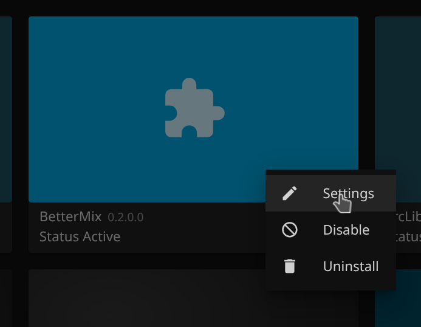

# BetterMix

**BetterMix** is a Jellyfin plugin that creates customizable smart playlists. It replaces Jellyfin's built-in *Instant Mix* feature and adds extra functionality to generate daily mixes for each user. The replacement of the *Instant Mix* feature, works by injecting an Action Filter to the Items Instant Mix controller (special thanks to [arnesacnussem](https://github.com/arnesacnussem/jellyfin-plugin-meilisearch) for inspiring that idea). The plugin uses the [Deej-AI model by teticio](https://github.com/teticio/Deej-AI), and is made possible thanks to their work. [deej-ai.cpp](https://github.com/StergiosBinopoulos/deej-ai.cpp) is used for the model inference and the playlist generation based on the output vectors. The plugin supports playlist generation for tracks and albums. The plugin is currently tested only on linux 64 bit machines.

## Setup


### 1. Install the Plugin 
### Add Plugin Repository (Option 1) (Linux 64 bit only)

#### Go to Dashboard
Navigate to Plugins > Catalog. Click the gear icon on the top left of the screen.


#### Add a new repositorty


Name the repository "BetterMix", paste the following url and save.
```bash
https://raw.githubusercontent.com/StergiosBinopoulos/jellyfin-plugin-bettermix/refs/heads/main/manifest.json
```


#### Find the plugin and install
Find the BetterMix Plugin in the catalog and install.


### Build from Source (Option 2)

#### Requirements
- **The Deej-AI model**
- **NET 8.0** (to build the plugin)
- **C++20**
- **CMake** ≥ 3.14
- **Ninja**
- **git**
- **ffmpeg libraries**
- **curl** (to download the model)

#### Clone the Repository

```bash
git clone https://github.com/StergiosBinopoulos/jellyfin-plugin-bettermix
cd jellyfin-plugin-bettermix
```

#### Build the plugin. 

Make sure you have the .NET 8.0 SDK installed. The *deej-ai.cpp* repo will be automatically downloaded and build. The model will also be automatically downloaded (from [here](https://huggingface.co/StergiosBinopoulos/deej-ai.onnx/resolve/main/)). To use a custom model; first convert your model to ONNX, afterward save your model in the root directory and rename it to *deej-ai.onnx* before running the build command.
```bash
dotnet build
```

Install the plugin. Copy the plugin folder to the Jellyfin plugins directory and restart Jellyfin in order for the plugin to start scanning.

```bash
sudo mkdir -p /var/lib/jellyfin/plugins/Jellyfin.Plugin.BetterMix/
sudo cp -r bin/Debug/net8.0/* /var/lib/jellyfin/plugins/Jellyfin.Plugin.BetterMix/
sudo chown -R jellyfin:jellyfin /var/lib/jellyfin/plugins/Jellyfin.Plugin.BetterMix/
sudo systemctl restart jellyfin
```

The plugin should now be functional. It will default to the native Instant Mix until the scan is completed. (this can take from minutes to several hours depending on your library size, rough estimate 1-2 seconds per track)

### 2. Configure the Plugin

You can configure and fine tune the plugin by using the Jellyfin plugin configuration page. Go to Dashboard > My Plugins. Find BetterMix, click on the three dots and select settings on the popup menu.



## 3. How to Know it is Working

Check if you can find the scan task in the Dashboard page.


or check the Logs.


Wait for the scan to complete and enjoy!
